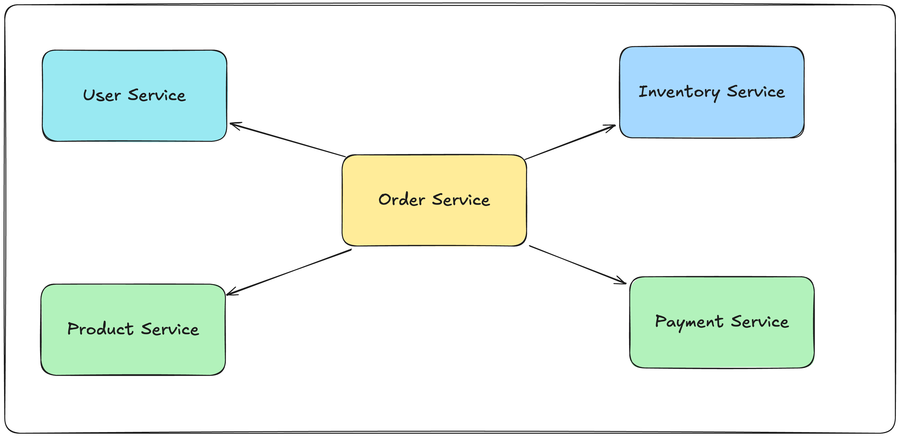

# Microservices Experimental

An experimental ecommerce-microservice projects for learning and testing

## Service Diagram



## 🎨 Database Designs

Read more from [here](./sql_generated_example.sql).

## Service Decomposition

```
┌─────────────────┐  ┌─────────────────┐  ┌─────────────────┐
│   User Service  │  │ Product Service │  │Inventory Service│
│                 │  │                 │  │                 │
│ • users         │  │ • categories    │  │ • inventory     │
│ • addresses     │  │ • products      │  │ • reservations  │
└─────────────────┘  └─────────────────┘  └─────────────────┘

┌─────────────────┐  ┌─────────────────┐
│  Order Service  │  │ Payment Service │
│                 │  │                 │
│ • orders        │  │ • payments      │
│ • order_items   │  │ • payment_hist  │
│ • order_addr    │  │                 │
│ • status_hist   │  │                 │
└─────────────────┘  └─────────────────┘
```

## 💼 Business Capability Alignment

- 🧑‍💼 User Service: User management, profiles, addresses (node.js)
- 📦 Product Service: Product catalog, categories (java)
- 📊 Inventory Service: Stock management, reservations (go)
- 🛒 Order Service: Order processing, order lifecycle (go)
- 💳 Payment Service: Payment processing, transactions (rust) 

## 🔄 Communication Patterns

#### Synchronous (API Calls):
```
Order Service → Product Service (validate products)
Order Service → User Service (validate user)
Order Service → Inventory Service (reserve stock)
Order Service → Payment Service (process payment)
```

#### Asynchronous (Events):
```
Order Created → Inventory Service (reserve stock)
Payment Completed → Order Service (update status)
Order Shipped → User Service (send notification)
```

## 🛠️ Technology Stack

#### API Layer:

- API Gateway (Kong/Ambassador)
- Service mesh (Istio)

#### Data Layer:

- PostgreSQL per service
- Redis for caching
- Message broker (RabbitMQ/Kafka)

#### Infrastructure:

- Kubernetes for orchestration
- Docker containers
- Helm charts for deployment

#### Observability:

- Prometheus + Grafana
- Jaeger for tracing
- ELK stack for logs
